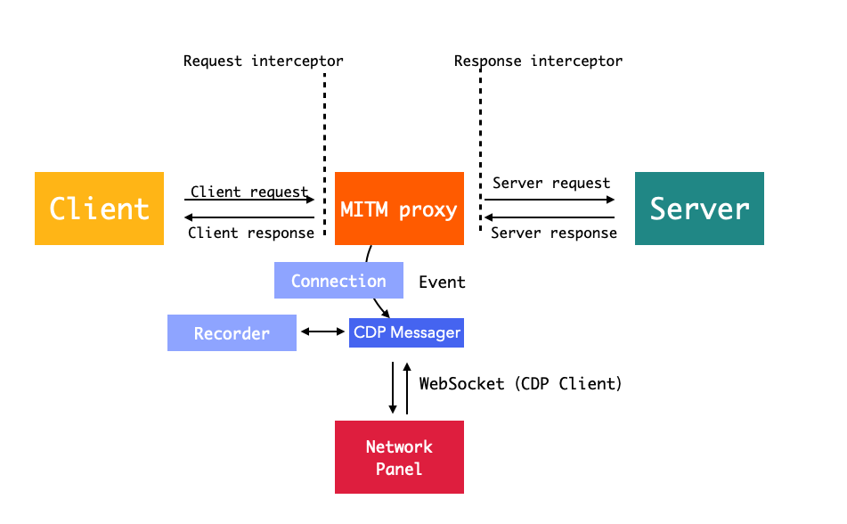

# Foxy 代理抓包功能 —— 用 Network 面板做 WebUI

> 利用中间人攻击原理，实现 http、https、websocket 抓包，可编程可扩展，支持插件、拦截器，使用 Chrome DevTools Network 面板做 UI 的「Fiddler」。

## 启动

在 devtools 的 bin 中使用`--proxy` flag 进行启动（默认启动），或者使用 `devtools.config`配置文件。

> 注意：
>
> 1. 在现在新版本的浏览器中，HTTPS 页面如果访问 HTTP 的资源会报[Mixed Content 错误](https://developer.mozilla.org/en-US/docs/Web/Security/Mixed_content)，所以 HTTPS 页面要进行调试需要建立 WSS 的 Websocket 连接，一般内核/Webview 可以在创建 Webview 的时候默认关闭该安全配置，用于线下包的开发调试。
> 2. iOS15+ Safari 在使用 https 的 URL，如果要链接 WSS 协议的 Websocket，需要关闭「NSURLSession WebSocket」（iOS15-默认是关闭的），路径 「iOS 设置 -> Safari -> 高级 -> Experimental Features -> NSURLSession WebSocket」 设置为关闭。详细：https://developer.apple.com/forums/thread/685403

## devtools.config.js 相关配置

Foxy 的相关配置可以在`devtools.config.js`的`proxy`中进行配置，配置项如下

-   proxy：
    -   `proxy.port`：代理服务器的端口号，默认 8002
    -   `proxy.plugins`：Foxy 插件
    -   `proxy.blocking`：拦截 host 配置，匹配正确则拦截，其他放行
    -   `proxy.nonBlocking`：不拦截（忽略）host 配置，匹配正确（`return true`）则忽略

> 1. `blocking`/`nonBlocking` 取值为`function|array<string|function>|string`，为需要拦截或者不需要拦截的 host 配置，`string`支持 glob 语法，如果是`function`则传入`request`对象和`test`函数用于自己实现匹配逻辑。
> 2. `blocking`/`nonBlocking`两个都存在，则取`blocking`
>    举例：如果我们让 Foxy 代理服务器只拦截百度域名，可以使用`blocking:'*.baidu.com'`

## 可编程支持

> Foxy 支持使用拦截器功能来实现功能扩展。Foxy 采用中间人攻击方式来实现代理服务，原理如图所示，设计上我们可以使用 interceptor 来对 request/response 进行拦截和修改，从而达到可编程可扩展特性。



核心概念介绍：

-   Client：发起请求的客户端
-   Server：实际请求的服务器端
-   MIMT Proxy：我们使用了 http-mitm-proxy 作为代理服务器；
-   Network Panel：我们修改的 Chrome Devtools 的面板，作为代理服务抓包的 WebUI
-   interceptor：在 request 和 response 阶段的拦截器，可以修改请求信息和 response 内容
-   Connection：每个请求创建的 connection 实例，保存了每次请求的信息，connection 会在全流程进行传递，最重要的是其中的`request`和`response`对象，下面拦截器会做详细介绍
-   CDP Messager：Proxy 和 Panel 之间的信使，通过监听 proxy 的事件（传递 Connection）做出相应的操作
-   CDP Client：为 Messager 和 Panel 之间的通信提供 WebSocket 通道
-   Recorder：对 response 的内容进行记录，用于 Panel 读取每个请求的详细内容

### interceptor 拦截器

你可以在`proxy.plugins`中使用 Foxy 的拦截器来拦截`request`/`response`。拦截器用法如下：

```js
// devtools.config.js
{
    proxy: {
        plugins: [
            (interceptor, proxyInstance) => {
                interceptor[interceptorName].add(({request, response}) => {
                    // 这里是拦截器实现
                }, filter);
            }
        ];
    }
}
```

`filter`是拦截过滤器，可以传入`glob`、`RegExp`或者 request 的拦截对象，例如：

-   拦截 baidu.com 的 host：`filter = {host:'*.baidu.com'}`
-   拦截微信 APP 页面：`filter={headers:{['user-agent']:/micromessenger/i}}`

可用的拦截器（`interceptorName`）包括：

-   `request`：在 request 阶段可以做请求转发和提前拦截返回 response，`params`：`{request,response}`
    -   可以读取 request 对象的内容，修改 request 对象配置，提前调用`response.end`返回数据
    -   提前返回数据则使用`response.end`，详细见 [response 对象](#response 对象)
-   `response`：response 阶段可以修改 response.body 内容，`params`：`{request,response}`
    -   在 response 阶段，可以对`response.body`进行修改
-   `websocketConnect`：websocket 建立连接阶段，可以用来做 websocket 转发，`params`：`{request}`
-   `websocketFrame`：每次收到 websocket 消息之后的拦截器，`params`：`{request,websocket}`

拦截器支持删除，`interceptor.add`返回一个拦截器 id，可以调用对应的`interceptor.remove`来移除拦截器，例如：

```js
// plugins中代码
const request = inteceptor.request;
// 添加拦截器
const id = request.add(
    ({request: req, response: res}) => {
        req.host = '127.0.0.1';
        req.rejectUnauthorized = false;
    },
    {host: 'devtools.pro'}
);
// 移除拦截器
request.remove(id);
```

### request 对象

> request 对象是在连接（Connection）创建的时候进行创建的。

#### request 属性

-   req：clientReq，只读
-   orginalUrl：原始 url，只读
-   protocol：协议，只读
-   fullUrl
-   port
-   host
-   headers
-   url
-   method
-   body
-   path
-   pathname

#### request 方法

-   `setHeader(name,value)`
-   `getHeader(name)`
-   `toJSON()`

### response 对象

> response 是请求 Connection 创建的对象

#### response 属性

-   res：真实的 clientRes，**修改 clientRes 内容不要使用，而是使用`response.end`**，只读
-   headersSent：clientRes 的`headersSent`，详见 nodejs 的 http 相关部分内容，只读
-   finished：clientRes 的`finished`，详见 nodejs 的 http 相关部分内容，只读
-   body：在 interceptor 中可以读取和修改 responseBody 内容
-   statusMessage
-   statusCode
-   headers
-   length：content-length
-   type：content-type

#### response 方法

-   `setHeader(name,value)`
-   `removeHeader(name)`
-   `getHeader(name)`
-   `write(chunk)`：等同于`clientRes.write`方法
-   `end(str|buffer)`：等同于`clientRes.end`方法，**提前结束 response，请调用该方法**
-   `toJSON()`

### websocket 对象

> websocket 对象只是在`websocketFrame`拦截器中接受的对象。

-   type：message/ping/pong
-   fromServer: boolean
-   body：websocket frame 的实际内容，可读可写

## 应用案例

> 1. 域名转发

```js
// foxy plugin
// 省略 (interceptor)=>{ interceptor.request}，下同
request.add(
    ({request}) => {
        request.host = 'www.google.com';
    },
    {host: 'www.baidu.com'}
);
```

> 2. 本地 mock 数据转发

Foxy 内置了一些常用的 interceptor，可以通过：`require('devtools-pro/intercetpor/*')`读取，下面是[localMock 的代码](../interceptors/localMock.js)实现

```js
const fs = require('fs');
const path = require('path');
const mimeType = require('mime-types');
const logger = require('../server/utils/logger');
module.exports = (mockConfig, filterOptions) => {
    // [{host: '', path: ''}, 'path string'/ function]
    return interceptor => {
        return interceptor.request.add(async ({request, response}) => {
            if (typeof mockConfig === 'function') {
                const p = await mockConfig(request, response);
                if (response.finished) {
                    // 已经执行了response.end()，说明自己反悔了
                    return;
                }
                if (typeof p === 'string') {
                    // 当做返回路径处理
                    mockConfig = p;
                }
            }
            if (typeof mockConfig === 'string') {
                // 作为文件路径
                path.isAbsolute(mockConfig) || (mockConfig = path.join(process.cwd(), mockConfig));
                // 从url得到path
                const url = request.url.split('?')[0];
                const filepath = path.join(mockConfig, url);
                try {
                    const contentType = mimeType.lookup(filepath);
                    response.type = contentType;
                    response.end(fs.readFileSync(filepath));
                } catch (e) {
                    logger.info('localmock inerceptor 读取文件失败');
                    logger.error(e);
                }
            }
            // 调用end，结束请求
            // response.end();
        }, filterOptions);
    };
};
```

> 3. 有条件的拦截：根据 UserAgent、域名进行拦截

```js
// foxy plugin
// 省略 (interceptor)=>{ interceptor.request}，下同
request.add(
    ({request}) => {
        // do some sthing
    },
    {host: '*.baidu.com'}
);

request.add(
    ({request}) => {
        // do some sthing
    },
    {
        headers: {
            'user-agent': /baiduboxapp/i
        }
    }
);
```

useragent 修改可以使用`devtools-pro/interceptors/userAgent`快速配置

> 4. response 数据修改

```js
response.add(({request: req, response: res}) => {
    res.body = res.body.replace('baidu.com', 'google.com');
});
```

> 5. 自动注入 backend.js

```js
const rootInstance = proxyInstance.serverInstance;
const port = rootInstance.getPort();
const protocol = rootInstance.isSSL() ? 'wss:' : 'ws:';
const backendjsUrl = `${
    rootInstance.isSSL() ? 'https' : 'http'
}://devtools.pro:${port}/backend.js?hostname=devtools.pro&port=${port}&protocol=${protocol}`;
const id = response.add(({request: req, response: res}) => {
    const type = res.type;
    const resourceType = getResourceType(type);
    if (resourceType === 'Document') {
        const body = res.body.toString();
        const htmlRegExp = /(<html[^>]*>)/i;
        if (!htmlRegExp.test(body)) {
            return;
        }
        const html = injectAssetsIntoHtml(
            body,
            {},
            {
                headTags: [
                    {
                        tagName: 'script',
                        attributes: {
                            src: backendjsUrl
                        }
                    }
                ]
            }
        );
        res.body = Buffer.from(html);
    }
});
```

详细代码：[injectBackend.js](../server/proxy/plugins/injectBackend.js)
